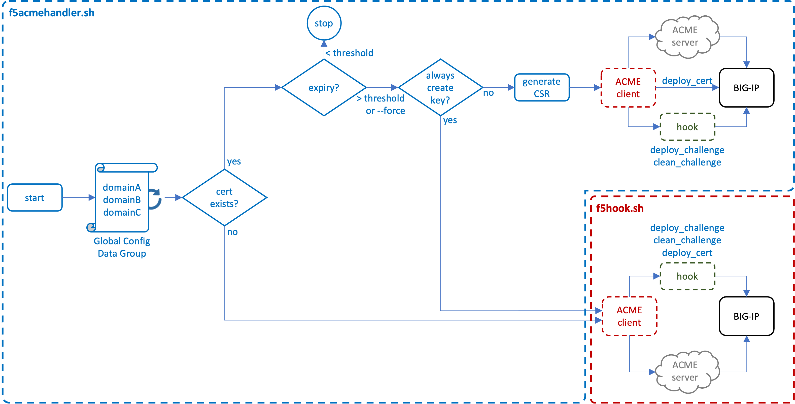
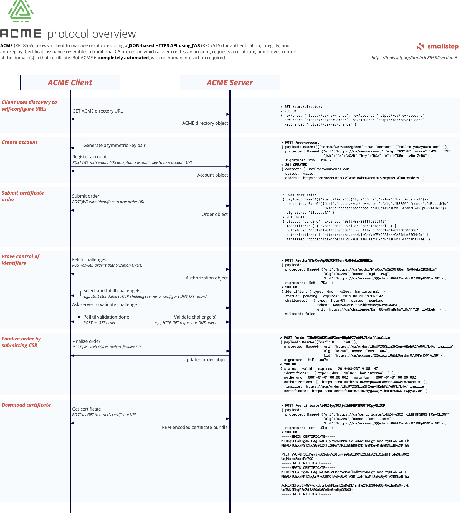

# KOJOT-ACME

### An ACMEv2 client utility function for integration and advanced features on the F5 BIG-IP

This project defines a set of utility functions for the [Dehydrated](https://github.com/dehydrated-io/dehydrated) ACMEv2 client, supporting direct integration with F5 BIG-IP, and including additional advanced features:

* Simple installation, configuration, and scheduling
* Supports renewal with existing private keys to enable certificate automation in HSM/FIPS environments
* Supports per-domain configurations, and multiple ACME providers
* Supports OCSP and periodic revocation testing
* Supports External Account Binding (EAB)
* Supports SAN certificate renewal
* Supports explicit proxy egress
* Supports granular scheduling
* Supports SMTP Reporting
* Supports high availability
* Supports debug logging

<br />

Why **Kojot**? Often pronounce "koyot", this is a word for "coyote" that has origins in Czech, Hungarian, Polish, and Serbo-Croatian languages. But most important, a famous coyote you may know, Wile E. Coyote, was a great consumer of ACME services, so the name checks out. ;)

<br />

------------
<!-- ### ${\textbf{\color{blue}Installation\ and\ Configuration}}$ --->
${\LARGE{\textnormal{\textbf{\color{blue}Installation\ and\ Configuration}}}}$

Installation to the BIG-IP is simple. The only constraint is that the certificate objects installed on the BIG-IP **must** be named after the certificate subject name. For example, if the certificate subject name is ```www.foo.com```, then the installed certificate and key must also be named ```www.foo.com```. Certificate automation is predicated on this naming construct. To install the utility functions to the BIG-IP:

<br />

* ${\normalsize{\textbf{\color{red}Step\ 1}}}$ (Install): SSH to the BIG-IP shell and run the following command. This will install all required components to the /shared/acme folder on the BIG-IP. In an HA environment, perform this action on both BIG-IP instances.

    ```bash
    curl -s https://raw.githubusercontent.com/f5devcentral/kojot-acme/main/install.sh | bash
    ```
    Optionally to include a proxy server to access the installation, add the -x (proxy) and --proxy argument (note the double set of double-dashes in Bash argument). The -x is an argument to the command line to use a proxy to fetch the install.sh script, and the --proxy argument is passed to the script itself.

    ```bash
    curl -ks -x 172.16.1.144:3128 https://raw.githubusercontent.com/kevingstewart/f5acmehandler-bash/main/install.sh | bash -s -- --proxy 172.16.1.144:3128
    ```

* ${\normalsize{\textbf{\color{red}Step\ 2}}}$ (Global Configuration): Update the new ```dg_acme_config``` data group and add entries for each managed domain (certificate subject). You must minimally include the subject/domain (key) and a corresponding ```--ca``` value. In an HA environment, this data group is synced between the peers. See the **Global Configuration Options** section below for additional details. Examples:

    ```lua
    www.foo.com := --ca https://acme-v02.api.letsencrypt.org/directory
    www.bar.com := --ca https://acme.zerossl.com/v2/DV90 --config /shared/acme/config_www_example_com
    www.baz.com := --ca https://acme.locallab.com:9000/directory -a rsa
    ```

* ${\normalsize{\textbf{\color{red}Step\ 3}}}$ (Client Configuration): Adjust the client configuration ```config``` file in the /shared/acme folder as needed for your environment. In most cases you will only need a single client config file, but this utility allows for per-domain client configurations. For example, you can define separate config files when EAB is needed for some provider(s), but not others. In an HA environment, the utility ensures these config files are available to the peer. See the **ACME Client Configuration Options** section below for additional details.

* ${\normalsize{\textbf{\color{red}Step\ 4}}}$ (HTTP Virtual Servers): Minimally ensure that an HTTP virtual server exists on the BIG-IP that matches the DNS resolution of each target domain (certificate subject). As a function of the ACMEv2 http-01 challenge process, the ACME server will attempt to contact the requested domain IP address on port 80 (HTTP). Attach the ```acme_handler_rule``` iRule to each HTTP virtual server.

* ${\normalsize{\textbf{\color{red}Step\ 5}}}$ (Initial Fetch):  Initiate an ACMEv2 fetch. This command will loop through the ```dg_acme_config``` global configuration data group and perform required ACMEv2 certificate renewal operations for each configured domain. By default, if no certificate and key exists for a domain, ACMEv2 renewal will generate a new certificate and key. If a private key exists, a CSR is generated from the existing key to renew the certificate only. This it to support HSM/FIPS environments, but can be disabled to always generate a new private key. See the **Utility Command Line Options** and **ACME Client Configuration Options** sections below for additional details.

    ```bash
    cd /shared/acme
    ./f5acmehandler.sh --verbose
    ```

* ${\normalsize{\textbf{\color{red}Step\ 6}}}$ (Schedule):  Once all configuration updates have been made and the utility function is working as desired, define scheduling to automate the process. By default, each domain (certificate) is checked against the defined threshold (default: 30 days) and only continues if the threshold is exceeded. In an HA environment, perform this action on both BIG-IP instances. See the **Scheduling** section below for additional details. For example, to set a weekly schedule, to initiate an update check **every Monday at 4am**:

    ```
    cd /shared/acme
    ./f5acmehandler.sh --schedule "00 04 * * 1"
    ```

* ${\normalsize{\textbf{\color{red}Step\ 7}}}$ (Client SSL Profile):  The ```f5acmehandler.sh``` utility maintains the freshness of the certificates (and private keys) installed on the BIG-IP. Ultimately, these certificates and keys will then need to be applied to SSL profiles, and the SSL profiles applied to application virtual servers. Creating the SSL profiles and virtual servers is outside the scope of this utility, but optionally you can set the **CREATEPROFILE** option in the client config file to 'true' to have the utility create a client SSL profile if missing, and attach the certificate and key to that profile.

<br />

------------
<!-- ### ${\textbf{\color{blue}Configuration\ Details}}$ --->
${\LARGE{\textnormal{\textbf{\color{blue}Configuration\ Details}}}}$

Configuration options for this utility are found in the following locations:

<details>
<summary><b>Global Configuration Options</b> define the set of domains that are to be handled, the (CA) directory URL of the designated ACMEv2 provider, and any optional unique configuration settings. This list is maintained in a BIG-IP data group (dg_acme_config)</summary>

<br />

Global configuration options are specified in the ```dg_acme_config``` data group for each domain (certificate subject). Each entry in the data group must include a **String**: the domain name (ex. www.foo.com), and a **Value** consisting of a number of configuration options:

<br />

| **Value Options** | **Description**                                                                                                                                                      | **Examples**                                                                                                                                                                                                                                                                                                                                                                                                    | **Required**                                         |
|-------------------|----------------------------------------------------------------------------------------------------------------------------------------------------------------------|-----------------------------------------------------------------------------------------------------------------------------------------------------------------------------------------------------------------------------------------------------------------------------------------------------------------------------------------------------------------------------------------------------------------|------------------------------------------------------|
| --ca              | Defines the ACME provider URL                                                                                                                                        | --ca https://acme-v02.api.letsencrypt.org/directory           (Let's Encrypt)<br />--ca https://acme-staging-v02.api.letsencrypt.org/directory   (LE Staging)<br />--ca https://acme.zerossl.com/v2/DV90                         (ZeroSSL)<br />--ca https://api.buypass.com/acme/directory                   (Buypass)<br />--ca https://api.test4.buypass.no/acme/directory              (Buypass Test)       |     $${\normalsize{\textbf{\color{red}Yes}}}$$       |
| --config          | Defines an alternate config file<br />(default /shared/acme/config)                                                                                                  | --config /shared/acme/config_www_foo_com                                                                                                                                                                                                                                                                                                                                                                        |     $${\normalsize{\textbf{\color{black}No}}}$$      |
| -a                | Overrides the required leaf certificate<br />algorithm specified in the config file.<br />Options:<br /><br />- rsa<br />- prime256v1<br />- secp384r1               | -a rsa<br />-a prime256v1<br />-a secp384r1                                                                                                                                                                                                                                                                                                                                                                     |     $${\normalsize{\textbf{\color{black}No}}}$$      |   

<br />

Examples:

```lua
www.foo.com := --ca https://acme-v02.api.letsencrypt.org/directory
www.bar.com := --ca https://acme.zerossl.com/v2/DV90 --config /shared/acme/config_www_example_com
www.baz.com := --ca https://acme.locallab.com:9000/directory -a rsa
```

</details>

<details>
<summary><b>ACME Client Configuration Options</b> define the per-domain ACMEv2 client attributes. These settings are maintained in a config text file stored in the "/shared/acme" folder on the BIG-IP.</summary>

<br />

Within the ```/shared/acme/config``` file are a number of additional client attributes. This utility allows for per-domain configurations, for example, when EAB is needed for some providers, but not others. Adjust the following atttributes as required for your ACME provider(s). All additional config files **must** start with "config_" (ex. config_www_foo_com).

| **Config Options**    | **Description**                                                                                                                                 |
|-----------------------|-------------------------------------------------------------------------------------------------------------------------------------------------|
| CURL_OPTS             | Defines specific attributes used in the underlying Curl functions. This could minimally<br />include:<br /><br />--http1.1          = use HTTP/1.1<br />-k                 = ignore certificate errors<br />-x \<proxy-url\>     = use an explicit proxy                                                         |
| KEY_ALGO              | Defines the required leaf certificate algorithm (rsa, prime256v1, or secp384r1)                                                                 |
| KEYSIZE               | Defines the required leaf certificate key size (default: 4096)                                                                                  |
| CONTACT_EMAIL         | Defines the registration account name and must be unique per provider requirements                                                              |
| OCSP_MUST_STAPLE      | Option to add CSR-flag indicating OCSP stapling to be mandatory (default: no)                                                                   |
| THRESHOLD             | Threshold in days when a certificate must be renewed (default: 30 days)                                                                         |
| ALWAYS_GENERATE_KEY   | Set to true to always generate a private key. Otherwise a CSR is created from an existing key to support HSM/FIPS environments (default: false) |
| CHECK_REVOCATION      | Set to true to attempt OCSP revocation check on existing certificates (default: false)                                                          |
| ERRORLOG              | Set to true to generate error logging (default: true)                                                                                           |
| DEBUGLOG              | Set to true to generate debug logging (default: false)                                                                                          |
| RENEW_DAYS            | Minimum days before expiration to automatically renew certificate (default: 30)                                                                 |
| OCSP_FETCH            | Fetch OCSP responses (default: no)                                                                                                              |
| OCSP_DAYS             | OCSP refresh interval (default: 5 days)                                                                                                         |
| EAB_KID/EAB_HMAC_KEY  | Extended Account Binding (EAB) support                                                                                                          |
| FULLCHAIN             | Set to true to install the complete certificate chain, or false to only install the leaf certificate (default: true)                            |
| ZEROCYLE              | Set to preferred number of zeroization cycles for shredding created private keys (default: 3 cycles)                                            |
| CREATEPROFILE         | Set to true to generate new client SSL profiles with new certs/keys (default: false)                                                            |
</details>

<details>
<summary><b>Utility Command Line Options</b> are command line arguments for the f5acmehandler.sh script used in maintenance operations.</summary>

<br />

The ```f5acmehandler.sh``` utility script also supports a set of commandline options for general maintenance usage. When no command options are specified, the utility loops through the ```dg_acme_config``` data group and performs required ACMEv2 certificate renewal operations for each configured domain.

| **Command Line Arguments**    | **Description**                                                                                  |
|-------------------------------|--------------------------------------------------------------------------------------------------|
| --force                       | Overrides the default certificate renewal threshold check (default 30 days)                     |
| --domain [domain]             | Performs ACME renewal functions for a single specified domain. Can be combined with --force<br />Examples:<br />--domain www.foo.com<br />--domain www.bar.com --force      |
| --listaccounts                | Lists the registered ACME provider accounts                                                      |
| --schedule [cron]             | Takes a cron string and installs this utility as a cron-scheduled process                        |
| --testrevocation [domain]     | Attempt to performs an OCSP revocation check on an existing certificate (domain)
| --uninstall                   | Deletes the cron scheduling                                                                      |
| --verbose                     | Dump verbose output to stdout                                                                    |
| --save                        | Save the local config to HA central store (only for HA)                                          |
| --help                        | Shows the help information for above command options                                             |
</details>

<details>
<summary><b>Scheduling Options</b></summary>

<br />

Scheduling is configured by adding the **--scheduling** command line argument, followed by a valid cron string. No validation is performed on the cron string input. Please take care to enter a valid string. A few recommended resources for developing cron strings are here:

* [Crontab Guru](https://crontab.guru/)
* [CronDrive](https://www.crondrive.com/test-cron-expression)

As a quick example:

| **Cron String** | **Description**                                                                                          |
|-----------------|----------------------------------------------------------------------------------------------------------|
| 00 04 1 * *     | Sets a **monthly** schedule to initiate an update on the **1st** day of each month at **04:00**          |
| 00 04 * * 1     | Sets a **weekly** schedule to initiate an update on **Monday** of every week at **04:00**                |
| 00 04 * * *     | Sets a **daily** schedule to initiate an update every day at **04:00**                                   |

where:

    1. minutes (0-59)
    2. hour (0-23)
    3. day of the month (1-31)
    4. month (1-12)
    5. day of the week (0-6)

```
./f5acmehandler.sh --schedule "00 04 * * 1"
```

</details>

<br />

------------
<!-- ### ${\textbf{\color{blue}ACME\ Protocol\ Flow}}$ --->
${\LARGE{\textnormal{\textbf{\color{blue}ACME\ Protocol\ Flow}}}}$

Provided below are detailed descriptions of the control flows. The **ACME Utility Architecture** section describes the files and folders in use. The **ACME Functional Flow on BIG-IP** section describes the interaction of ```f5acmehandler``` and ACME client processes. The **ACME Protocol Flow Reference** details the general ACMEv2 protocol flow per [RFC8555](https://datatracker.ietf.org/doc/html/rfc8555).

<details>
<summary><b>ACME Utility Architecture</b></summary>

The f5acmehandler utility contains the following files and folders in the ```/shared/acme/``` folder on the BIG-IP:

| **File/Folder**  | **Description**                                                                                                                |
|------------------|--------------------------------------------------------------------------------------------------------------------------------|
| accounts/        | The Folder containing registration information (subfolders) for each ACME provider.                                            |
| certs/           | The Folder for ephemeral certificate information (CSRs, certificates), cleared after each ACME renewal operation.              |
| config           | A text file containing the client configuration. Multiple provider-specific config files may be created as needed.             |
| config_reporting | A text file containing the smtp reporting configuration.                                                                       |
| dehydrated       | The ACME client script.                                                                                                        |
| f5acmehandler.sh | The ACME client wrapper utility script. This is the script that gets scheduled, and handles all renewal processing.            |
| f5hook.sh        | The ACME client hook script. This script is called by the ACME client to handle deploy challenge and clean challenge actions.  |

The ```install.sh``` script is called from a Bash shell on the BIG-IP to:

* Download all of the above files to the ```/shared/acme/``` folder on the BIG-IP
* Download the ```dehydrated``` ACME client from its separate repository
* Create ```the dg_acme_config``` and ```dg_acme_challenge``` data groups on the BIG-IP
* Create the ```acme_handler_rule``` iRule on the BIG-IP
* Create the ```/var/log/acmehandler``` log file on the BIG-IP


<br />

</details>

<details>
<summary><b>ACME Functional Flow on BIG-IP</b></summary>

The fundamental functional flow is illustrated here. 



On ```f5acmehandler.sh``` script initiation, the ```dg_acme_config``` data group is read, and for each domain entry the following logic is applied:

* **Certificate does not exist**: If the domain (certificate) does not exist on the BIG-IP, the ACME client is triggered directly with corresponding configuration settings. During ACME client processing, a separate ```hook``` script is called to perform the following actions:

  - **deploy_challenge**: Take the token filename and token value passed to the client from the ACME server, and insert those as ephemeral entries in an ```dg_acme_challenge``` data group. The ACME server will issue an http-01 challenge to a corresponding HTTP virtual server on the BIG-IP. An iRule on the VIP reads from the data group and responds to the ACME challenge with the correct token.

  - **clean_challenge**: Once the ACME server has completed its http-01 challenge, the ephemeral entry is removed from the data group.

  - **deploy_cert**: The ACME server will return a new certificate and private key to the ACME client, which is then installed to the BIG-IP.

<br />

* **Certificate exists**: If the domain (certificate) exists on the BIG-IP, the certificate's expiration date is compared to the defined THRESHOLD value. If the date is less than the THRESHOLD, processing for this domain ends. If the date is greater than or equal to the THRESHOLD, or the ```--force``` commandline argument is used with f5acmehandler.sh:

  - **Always generate key**: If the **ALWAYS_GENERATE_KEY** setting is true, the ACME client is triggered directly and continues as described above as if the certificate does not exist. In this case, however, the resulting certificate and private key *replace* an existing certificate/key pair on the BIG-IP.
 
  - **Generate CSR**: Otherwise, a CSR is generated from the existing private key and then passed to the ACME client. When using the ACME client with a CSR, only the ```deploy_challenge``` and ```clean_challenge``` functions are called. The renewed certificate is passed back to f5acmehandler, which then replaces the existing certificate on the BIG-IP.

<br />

***Note***: Any key material created in the BIG-IP file system is *zeroized* with a minimal of three wipe cycles. This can be changed by adjusting the **ZEROCYCLE** value in the ```f5hook.sh``` script.

<br />

</details>

<details>
<summary><b>ACME Protocol Flow Reference</b></summary>

The ACMEv2 protocol process is expertly described in the following diagram

(source: [https://cms.step.plumbing/uploads/acme_how_it_works_88d170c87a.png](https://cms.step.plumbing/uploads/acme_how_it_works_88d170c87a.png))



</details>

<br />

------------
<!-- ### ${\textbf{\color{blue}Additional\ Configuration\ Options}}$ --->
${\LARGE{\textnormal{\textbf{\color{blue}Additional\ Configuration\ Options}}}}$

Below are descriptions of additional features and environment options.

<details>
<summary><b>External Account Binding (EAB)</b></summary>

External Account Binding (EAB) "pre-authentication" is defined in the [ACME RFC](https://datatracker.ietf.org/doc/html/rfc8555#section-7.3.4). This is used to associate an ACME account with an existing account in a non-ACME system. The CA operating the ACME server provides a **MAC Key** and **Key Identifier**, which must be included in the ACME client registration process. The client MAC and Key ID are specified within the ```/shared/acme/config``` file. Example:

```bash
# Extended Account Binding (EAB) support
EAB_KID=kid-1
EAB_HMAC_KEY=zWNDZM6eQGHWpSRTPal5eIUYFTu7EajVIoguysqZ9wG44nMEtx3MUAsUDkMTQ12W
```

<br />

</details>

<details>
<summary><b>OCSP and Periodic Revocation Testing</b></summary>

<br />

As a function of the utility, OCSP revocation status can be tested on existing certificates. This is set with the **CHECK_REVOCATION** value in the client config file, by default disabled (false). When enabled, and the certificate exists on the BIG-IP, the PEM certificate, issuer, and OCSP URI values are collected and a direct OCSP check is performed. If the certificate is revoked, a new certificate and private key are requested (vs. generating a CSR on the existing private key).

It is also possible to perform a direct check of revocation with the **--testrevocation** command line argument, followed by the certificate name (domain) as specified on the BIG-IP.

```
cd /shared/acme
./f5acmehandler.sh --testrevocation foo.f5labs.com
```

This will return one of the following possible values:

| **Value**   | **Description**                                                                                                                                  |
|-------------|--------------------------------------------------------------------------------------------------------------------------------------------------|
| revoked     | The OCSP check was successful and the response was revoked                                                                                       |
| notrevoked  | The OCSP check was successful and the response was not revoked                                                                                   |
| unavailable | The OCSP check was not performed, in the case that the utility is unable to collect a chain (issuer) and OCSP URI value from the certificate     |

<br />

</details>

<details>
<summary><b>High Availability</b></summary>
    
In an HA environment, the ```f5acmehandler.sh``` utility stores state information in iFile objects. On start, account and config state are pulled from the iFiles, and on completion, the account and config state is pushed back to iFiles if any changes are detected:

| **iFile**              | **Description**                                                                                                                                  |
|------------------------|--------------------------------------------------------------------------------------------------------------------------------------------------|
| f5_acme_account_state  | Stores the compressed and encoded contents of the /shared/acme/accounts folder                                                                   |
| f5_acme_config_state   | Stores the compressed and encoded contents of all "config*" files in /shared/acme                                                                |

While account state is always read from and pushed back to iFile (in an HA environment), the ```--save``` command-line option enables the utility script to read from local config files, then pushing all config state up to iFiles on completion. In Standalone environments, account and config state are always stored locally in the /shared/acme folder.

```
./f5acmehandler.sh --save
```

<br />

</details>

<details>
<summary><b>Working with BIG-IQ</b></summary>

Working with BIG-IQ primarily involves "Script Management", and can broken down into the following set of tasks:

* On the BIG-IP(s), ensure Advanced Shell access is enabled for the admin user:
  - System --> Users --> User List --> Admin user
  - Terminal Access: Advanced shell 

* **Installing the f5acmehandler utility** (on all managed BIG-IP devices)
  - Devices --> Script Management --> Scripts (Add)
      - Name: Install f5acmehandler utility
      - Script:

      ```
      curl -s https://raw.githubusercontent.com/f5devcentral/kojot-acme/main/install.sh | bash
      ```
      - Save & Close
   
  - Devices --> Script Management --> Scripts (Run)
      - Name: Install f5acmehandler utility
      - Script: (select script)
      - Select BIG-IP Devices: (select all managed BIG-IP devices)

* **Scheduling the f5acmehandler utility** (on all managed BIG-IP devices)
  - Devices --> Script Management --> Scripts (Add)
      - Name: Schedule f5acmehandler utility
      - Script:

      ```
      tmsh modify ltm data-group internal dg_acme_config records replace-all-with { \
      "bar.acmelabs.com" { data "-a rsa --ca https://10.1.30.6:14000/dir" } \
      "foo.acmelabs.com" { data "-a rsa --ca https://10.1.30.6:9000/acme/acme/directory" } \
      "test.acmelabs.com" { data "-a rsa --ca https://10.1.30.6:14000/dir" } \
      "www.acmelabs.com" { data "-a rsa --ca https://10.1.30.6:9000/acme/acme/directory" } }
      ```
      - Save & Close

  - Devices --> Script Management --> Scripts (Run)
      - Name: Schedule f5acmehandler utility
      - Script: (select script)
      - Select BIG-IP Devices: (select all managed BIG-IP devices)

* **Initiating a first run of the f5acmehandler utility** (on the **active** BIG-IP devices)
  - Devices --> Script Management --> Scripts (Add)
      - Name: Run f5acmehandler utility
      - Script:

      ```
      /shared/acme/f5acmehandler.sh --verbose
      ```
      - Save & Close

  - Devices --> Script Management --> Scripts (Run)
      - Name: Run f5acmehandler utility
      - Script: (select script)
      - Select BIG-IP Devices: (select the **active** BIG-IP devices)

<br />

</details>

<details>
<summary><b>Reporting</b></summary>

The f5acmehandler utility can generate reports on renewal functions and send an email via SMTP configuration. This configuration is stored in the ```/shared/acme/config_reporting``` file:

| **Value Options** | **Description**                                                                                                                                                                                                                                       |
|-------------------|-------------------------------------------------------------------------------------------------------------------------------------------------------------------------------------------------------------------------------------------------------|
| ENABLE_REPORTING  | Set to 'true' to enable EMAIL reporting.                                                                                                                                                                                                              |
| MAILHUB           | Set this to the email SMTP host and port. Example: smtp.sendgrid.net:587                                                                                                                                                                              |
| USERSTARTTLS      | Set this to 'yes' to enable StartTLS, as required by the SMTP server.                                                                                                                                                                                 |
| USETLS            | Set this to 'yes' to enable SSL/TLS, as required by the SMTP server.                                                                                                                                                                                  |
| AUTHUSER          | Set the username if the SMTP server requires authentication. No quotation marks needed here.                                                                                                                                                          |
| AUTHPASS          | Set the user password if the SMTP server requires authentication. No quotation marks needed here.                                                                                                                                                     |
| REPORT_FROM       | Set the email address of the sender.                                                                                                                                                                                                                  |
| REPORT_TO         | Set the email address of the receiver.                                                                                                                                                                                                                |
| REPORT_SUBJECT    | Set the email Subject line.                                                                                                                                                                                                                           |
| TLS_CA_FILE       | Set this to the local path of a CA certificate bundle file for validating the SMTP server certificate. The install script automatically copies the ca-bundle.crt file to the local working directory, so this would be '/shared/acme/ca-default.crt'. |
| FROMLINEOVERRIDE  | Set to 'yes' to override the From line. This is needed by the utility script.                                                                                                                                                                         |

<br />

With the above settings defined, you can test the SMTP config from the BIG-IP command line with the following:

```
echo -e "From: <sender email address>\nSubject: Test Email\n\nTest Email" | ssmtp -v -C /shared/acme/config_reporting <receiver email address>
```

Verbosity is set in the ssmtp command so the full transaction will dump to stdout for troubleshooting.


<br />

</details>

<details>
<summary><b>Uninstall</b></summary>

To uninstall all objects:

```bash
curl -s https://raw.githubusercontent.com/f5devcentral/kojot-acme/main/uninstall.sh | bash
```

***Note** that the dg_acme_challenge data group, and acme_handler_rule iRule are not deleted in the uninstall script, as they are referenced outside of the ```f5acmehandler.sh``` utility.*

<br />

</details>

<br />


------------
<!-- ### ${\textbf{\color{blue}Troubleshooting}}$ --->
${\LARGE{\textnormal{\textbf{\color{blue}Troubleshooting}}}}$

<details>
<summary><b>Error Messaging</b></summary>

The f5acmehandler.sh utility provides the following error messages:

| **Message**                                                                            | **Description**                                                                                                                                   |
|----------------------------------------------------------------------------------------|---------------------------------------------------------------------------------------------------------------------------------------------------|
| PANIC: There was an error accessing the dg_acme_config data group. Please re-install.  | The global configuration data group cannot be found. Re-install the utility from the repo to repair.                                              |
| PANIC: Specified config file for (DOMAIN) does not exist (CONFIG FILE)                 | A config file (--config file) specified in the global configuration data group does not exist. Confirm that the file exists and path is correct.  |
| PANIC: Configuration entry for (DOMAIN) must include a \"--ca\" option. Skipping.      | A domain entry in the global configuration data group is missing the --ca option. This value is required for all domain entries.                  |
| PANIC: Configuration entry (DOMAIN) is incorrect. Skipping.                            | A domain entry in the global configuration data group does not meet minimal fully qualified domain name pattern validation.                       |
| PANIC: Connectivity error for (DOMAIN). Please verify configuration (CA URL)           | The ACME client was unable to connect to the defined ACME provider URL. Verify that --ca value is correct in the global configuration data group. |
| ERROR: Please correct the format of supplied cron string. No schedule applied.         | A supplied CRON string in a --schedule operation does not meet minimum CRON pattern validation.                                                   |

<br />

</details>

<details>
<summary><b>General Troubleshooting</b></summary>

Below are a common set of steps for troubleshooting utility operations:

- Use the ```--verbose``` option on the command line to output debug messaging. This will most often display any issues during the ACME renewal process.
- If verbose logging indicates a registration issue with a provider, delete the respective provider subfolder under the /shared/acme/accounts folder. The registered providers can be listed using the ```--listaccounts``` command line option. The utility will attempt to re-register to the provider on next run.
- Use the ```--domain```, ```--force```, and ```--verbose``` command line options to test against a single provider for easier troubleshooting. It may also be beneficial to stand up one of the local ACME services (via Docker-Compose) to test general functionality if the real ACME providers inforce connection limits.

<br />

</details>

<br />

------------
<!-- ### ${\textbf{\color{blue}Testing}}$ --->
${\LARGE{\textnormal{\textbf{\color{blue}Testing}}}}$

There are a number of ways to test the ```f5acmehandler``` utility, including validation against local ACME services. The **acme-servers** folder contains Docker-Compose options for spinning up local **Smallstep Step-CA** and **Pebble** ACME servers. The following describes a very simple testing scenario using one of these tools.

* On the BIG-IP, install the f5acmehandler utility components on the BIG-IP instance. SSH to the BIG-IP shell and run the following command:

    ```bash
    curl -s https://raw.githubusercontent.com/f5devcentral/kojot-acme/main/install.sh | bash
    ```
    
* Install the **Smallstep Step-CA** ACME server instance on a local Linux machine. Adjust the local /etc/hosts DNS entries at the bottom of the docker-compose YAML file accordingly to allow the ACME server to locally resolve your ACME client instance (the set of BIG-IP HTTP virtual servers). This command will create an ACME service listening on HTTPS port 9000.

    ```bash
    git clone https://github.com/f5devcentral/kojot-acme.git
    cd kojot-acme/acme-servers/
    docker-compose -f docker-compose-smallstep-ca.yaml up -d
    ```

* On the BIG-IP, for each of the above /etc/hosts entries, ensure that a matching HTTP virtual server exists on the BIG-IP. Define the destination IP (same as /etc/hosts entry), port 80, a generic ```http``` profile, the proper listening VLAN, and attach the ```acme_handler_rule``` iRule.

* On the BIG-IP, update the ```dg_acme_config``` data group and add an entry for each domain (certificate). This should match each ```/etc/hosts``` domain entry specified in the docker-compose file.

    ```lua
    www.foo.com := --ca https://<acme-server-ip>:9000/acme/acme/directory
    www.bar.com := --ca https://<acme-server-ip>:9000/acme/acme/directory -a rsa
    ```
    
* To view DEBUG logs for the f5acmehandler processing, ensure that the ```DEBUGLOG``` entry in the config file is set to true. Then in a separate SSH window to the BIG-IP, tail the ```acmehandler``` log file:

    ```bash
    tail -f /var/log/acmehandler
    ```
  or use the ```--verbose``` option with the f5acmehandler.sh script:

    ```bash
    ./f5acmehandler.sh --verbose
    ```

* Trigger an initial ACMEv2 certificate fetch. This will loop through the ```dg_acme_config``` data group and process ACME certificate renewal for each domain. In this case, it will create both the certificate and private key and install these to the BIG-IP. You can then use these in client SSL profiles that get attached to HTTPS virtual servers. In the BIG-IP, under **System - Certificate Management - Traffic Certificate Management - SSL Certificate List**, observe the installed certificate(s) and key(s). 

* Trigger a subsequent ACME certificate fetch, specifying a single domain and forcing renewal. Before launching the following command, open the properties of one of the certificates in the BIG-IP UI. After the command completes, refresh the certificate properties and observe the updated Serial Number and Fingerprint values.

    ```bash
    ./f5acmehandler.sh --domain www.foo.com --force
    ```
 

<br />

------------
<!-- ### ${\textbf{\color{blue}Credits}}$ --->
${\LARGE{\textnormal{\textbf{\color{blue}Credits}}}}$

Special thanks to: 
- [@f5-rahm](https://github.com/f5-rahm) and his [lets-encrypt-python](https://github.com/f5devcentral/lets-encrypt-python) project for inspiration, and for coming up with the cool project name. ;)
- [@Lukas2511](https://github.com/Lukas2511) for the [dehydrated ACME client utility](https://github.com/dehydrated-io/dehydrated)

<br />
<br />
<br />
