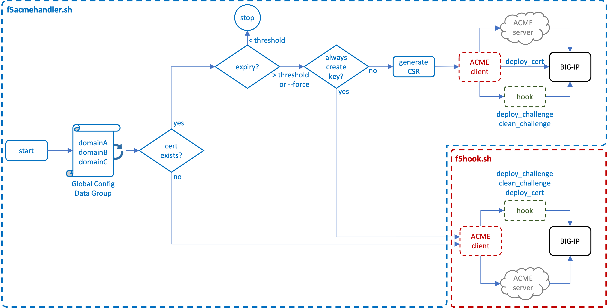
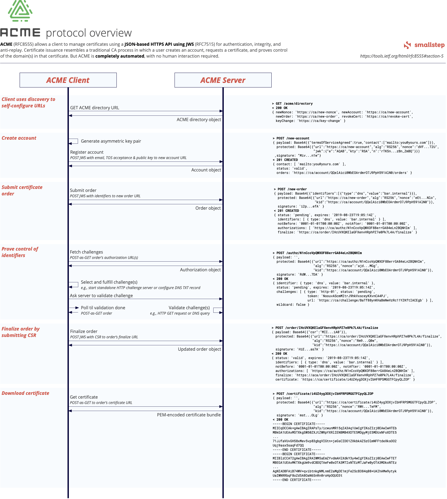
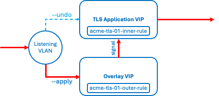

# KOJOT-ACME

### An ACMEv2 client utility function for integration and advanced features on the F5 BIG-IP

*Major Updates May 12, 2026 - See updates section at bottom for changes*

This project defines a set of utility functions for the [Dehydrated](https://github.com/dehydrated-io/dehydrated) ACMEv2 client, supporting direct integration with F5 BIG-IP, and including additional advanced features:

* Simple installation, configuration, and scheduling
* Supports renewal with existing private keys to enable certificate automation in HSM/FIPS environments
* Supports per-domain configurations, to multiple ACME providers
* Supports both the HTTP-01, DNS-01, and TLS-ALPN-01 validation mechanisms
* Supports wildcard certificates for DNS-01 and EAB providers
* Supports OCSP and periodic revocation testing
* Supports External Account Binding (EAB)
* Supports device certificate management
* Supports SAN certificate renewal
* Supports explicit proxy egress
* Supports granular scheduling
* Supports DNS-01 alias mode
* Supports SMTP Reporting
* Supports high availability
* Supports debug logging

<br />

Why **Kojot**? Often pronounce "koyot", this is a word for "coyote" that has origins in Czech, Hungarian, Polish, and Serbo-Croatian languages. But most important, a famous coyote you may know, Wile E. Coyote, was a great consumer of ACME services, so the name checks out. ;)

<br />

------------
${\Large{\textsf{\color{blue}Installation\ and\ Configuration}}}$

Installation to the BIG-IP is simple. The only constraint is that the certificate objects installed on the BIG-IP **must** be named after the certificate subject name (unless the --alias flag is used). For example, if the certificate subject name is ```www.foo.com```, then the installed certificate and key must also be named ```www.foo.com```. Certificate automation is predicated on this naming construct. To install the utility functions to the BIG-IP:

<br />

* ${\normalsize{\textsf{\color{red}Step\ 1}}}$ (Install): SSH to the BIG-IP shell and run the following command. This will install all required components to the /shared/acme folder on the BIG-IP. In an HA environment, perform this action on both BIG-IP instances.

    ```bash
    curl -s https://raw.githubusercontent.com/f5devcentral/kojot-acme/main/install.sh | bash
    ```
    Optionally to include a proxy server to access the installation, add the -x (proxy) and --proxy argument (note the double set of double-dashes in Bash argument). The -x is an argument to the command line to use a proxy to fetch the install.sh script, and the --proxy argument is passed to the script itself.

    ```bash
    curl -ks -x 172.16.1.144:3128 https://raw.githubusercontent.com/f5devcentral/kojot-acme/main/install.sh | bash -s -- --proxy 172.16.1.144:3128
    ```

* ${\normalsize{\textsf{\color{red}Step\ 2}}}$ (Certificates Configuration): Update the new ```dg_acme_config``` data group and add entries for each managed domain (certificate subject). You must minimally include the subject/domain (key) and a corresponding ```--ca``` value. In an HA environment, this data group is synced between the peers. See the **Certificates Configuration Options** section below for additional details. Examples:

    ```lua
    www.foo.com := --ca https://acme-v02.api.letsencrypt.org/directory
    www.bar.com := --ca https://acme.zerossl.com/v2/DV90 --config /shared/acme/config_www_example_com
    www.baz.com := --ca https://acme.locallab.com:9000/directory -a rsa
    ```

* ${\normalsize{\textsf{\color{red}Step\ 3}}}$ (Provider Configuration): Adjust the default provider configuration ```config``` file in the /shared/acme folder as needed for your specific provider. In most cases you will only need a single provider config file, but this utility allows for per-provider configurations. For example, you can define separate config files when EAB is needed for some provider(s), but not others. In an HA environment, the utility ensures these config files are available to the peer. See the **ACME Provider Configuration Options** section below for additional details.

* ${\normalsize{\textsf{\color{red}Step\ 4}}}$ (HTTP Virtual Servers): For HTTP-01 validation, minimally ensure that an HTTP virtual server exists on the BIG-IP that matches the DNS resolution of each target domain (certificate subject). As a function of the ACMEv2 http-01 challenge process, the ACME server will attempt to contact the requested domain IP address on port 80 (HTTP). Attach the ```acme_handler_rule``` iRule to each HTTP virtual server.

* ${\normalsize{\textsf{\color{red}Step\ 5}}}$ (Initial Fetch): Initiate an ACMEv2 fetch. This command will loop through the ```dg_acme_config``` certificates configuration data group and perform required ACMEv2 certificate renewal operations for each configured domain. By default, if no certificate and key exists for a domain, ACMEv2 renewal will generate a new certificate and key. If a private key exists, a CSR is generated from the existing key to renew the certificate only. This it to support HSM/FIPS environments, but can be disabled to always generate a new private key. See the **Utility Command Line Options** and **ACME Povider Configuration Options** sections below for additional details.

    ```bash
    cd /shared/acme
    ./f5acmehandler.sh --verbose
    ```

* ${\normalsize{\textsf{\color{red}Step\ 6}}}$ (Schedule): Once all configuration updates have been made and the utility function is working as desired, define scheduling to automate the process. By default, each domain (certificate) is checked against the defined threshold (default: 30 days) and only continues if the threshold is exceeded. In an HA environment, perform this action on both BIG-IP instances. See the **Scheduling** section below for additional details. For example, to set a weekly schedule, to initiate an update check **every Monday at 4am**:

    ```
    cd /shared/acme
    ./f5acmehandler.sh --schedule "00 04 * * 1"
    ```

* ${\normalsize{\textsf{\color{red}Step\ 7}}}$ (Client SSL Profile): The ```f5acmehandler.sh``` utility maintains the freshness of the certificates (and private keys) installed on the BIG-IP. Ultimately, these certificates and keys will then need to be applied to SSL profiles, and the SSL profiles applied to application virtual servers. Creating the SSL profiles and virtual servers is outside the scope of this utility, but optionally you can set the **CREATEPROFILE** option in the client config file to 'true' to have the utility create a client SSL profile if missing, and attach the certificate and key to that profile.

<br />

------------
${\Large{\textsf{\color{blue}Configuration\ Details}}}$

The ACMEv2 configuration is broken into two components --> the **provider** configuration that describes the ACMEv2 server (including validation mode, authentication, and revocation & renewal settings), and the **certificates** configuration that describes each managed certificate. The provider configuration is stored in ```config``` files in the /shared/acme working folder. A default ```config``` file is included (/shared/acme/config), but others can be created if multiple ACMEv2 providers are needed and require different settings. The certificates configuration is stored in the ```dg_acme_config``` data group and must minimally include the provider URL, but may also point to a specific ```config``` file. If the config file is not specified, the default config file will be used.

Configuration options for this utility are found in the following locations:

<details>
<summary><b>Providers Configuration Options</b> define the per-provider ACMEv2 attributes. These settings are maintained in a config text file stored in the "/shared/acme" folder on the BIG-IP.</summary>

<br />

Within the ```/shared/acme/config``` file are a number of additional client attributes. This utility allows for per-domain configurations, for example, when EAB is needed for some providers, but not others. Adjust the following atttributes as required for your ACME provider(s). All additional config files **must** start with "config_" (ex. config_www_foo_com).

| **Config Options**   | **Description**                                                                                                                                                                                                                                                                 |
|----------------------|---------------------------------------------------------------------------------------------------------------------------------------------------------------------------------------------------------------------------------------------------------------------------------|
| CURL_OPTS            | Defines specific attributes used in the underlying Curl functions. This could minimally include:    --http1.1 = use HTTP/1.1  -k  = ignore certificate errors  -x [proxy-url:port] = use an explicit proxy                                                                      |
| KEY_ALGO             | Defines the required leaf certificate algorithm (rsa, prime256v1, or secp384r1)                                                                                                                                                                                                 |
| KEYSIZE              | Defines the required leaf certificate key size (default: 4096)                                                                                                                                                                                                                  |
| CONTACT_EMAIL        | Defines the registration account name and must be unique per provider requirements                                                                                                                                                                                              |
| OCSP_MUST_STAPLE     | Option to add CSR-flag indicating OCSP stapling to be mandatory (default: no)                                                                                                                                                                                                   |
| THRESHOLD            | Threshold in days when a certificate must be renewed (default: 30 days)                                                                                                                                                                                                         |
| VALIDATION_TIMEOUT   | Amount of seconds to wait for domain validation processing until erroring out (default: 0 => no timeout)                                                                                                                                                                        |
| ORDER_TIMEOUT        | Amount of seconds to wait for processing of order until erroring out (default: 0 => no timeout)                                                                                                                                                                                 |
| ACME_METHOD          | Defines the ACMEv2 validation method to use (http-01, or dns-01) (default: http-01)                                                                                                                                                                                             |
| DNS_2_PHASE          | When using dns-01 validation, enabled manual 2 phase validation (create DNS entry manually, clean DNS entry manually)                                                                                                                                                           |
| DNS_DELAY            | When using dns-01 validation, defines the delay between deploying the DNS validation, and cleaning up the DNS entry (allows additional time for slow changes)                                                                                                                   |
| DNSAPI               | When using dns-01 validation, defines the name of the validation script in the /shared/acme/dnsapi folder that will perform deploy and clean functions. The DNS provider will typically have additional variables that must be created (i.e., JWT token, user:pass, etc.)       |
| FORCE_SYNC           | Option to force HA sync on certificate updates. When disabled, change data is stored to iFile object and requires an auto sync to ensure consistency. When this option is enabled, an HA sync is triggered when there is an update to any of the certificates. (default: false) |
| DEVICE_GROUP         | When FORCE_SYNC is true, you must also specify the BIG-IP Device Group name.                                                                                                                                                                                                    |
| ALWAYS_GENERATE_KEY  | Set to true to always generate a private key. Otherwise a CSR is created from an existing key to support HSM/FIPS environments (default: false)                                                                                                                                 |
| CHECK_REVOCATION     | Set to true to attempt OCSP revocation check on existing certificates (default: false)                                                                                                                                                                                          |
| ERRORLOG             | Set to true to generate error logging (default: true)                                                                                                                                                                                                                           |
| DEBUGLOG             | Set to true to generate debug logging (default: false)                                                                                                                                                                                                                          |
| SYSLOG               | Set to a Syslog facility and severity level if Syslog is required for log events (ex. local0.err). Leave empty to disable Syslog.                                                                                                                                               |
| DEVICEHOOK           | Set to the name of a local Bash script to be used to copy a certificate and key to a control plane location. Used to support ACME renewal for device certificates. Example: DEVICEHOOK="/shared/acme/f5devicehook.sh"                                                           |
| RENEW_DAYS           | Minimum days before expiration to automatically renew certificate (default: 30)                                                                                                                                                                                                 |
| OCSP_FETCH           | Fetch OCSP responses (default: no)                                                                                                                                                                                                                                              |
| OCSP_DAYS            | OCSP refresh interval (default: 5 days)                                                                                                                                                                                                                                         |
| EAB_KID/EAB_HMAC_KEY | Extended Account Binding (EAB) support                                                                                                                                                                                                                                          |
| FULLCHAIN            | Set to true to install the complete certificate chain, or false to only install the leaf certificate (default: true)                                                                                                                                                            |
| ZEROCYLE             | Set to preferred number of zeroization cycles for shredding created private keys (default: 3 cycles)                                                                                                                                                                            |
| CREATEPROFILE        | Set to true to generate new client SSL profiles with new certs/keys (default: false)                                                                                                                                                                                            |

</details>

<details>
<summary><b>Certificates Configuration Options</b> define the set of certificates that are to be handled, the (CA) directory URL of the designated ACMEv2 provider, and any optional unique configuration settings. This list is maintained in a BIG-IP data group (dg_acme_config)</summary>

<br />

Certificate configuration options are specified in the ```dg_acme_config``` data group for each domain (certificate subject). Each entry in the data group must include a **String**: the domain name (ex. www.foo.com), and a **Value** consisting of a number of configuration options:

<br />

| <div style="width:100px">**Value Options**</div> | **Description**                                                                                                                                                                                                                                                                                             | **Examples**                                                                                                                                                                                                                                                                                                                                       | **Required**                                |
|--------------------------------------------------|-------------------------------------------------------------------------------------------------------------------------------------------------------------------------------------------------------------------------------------------------------------------------------------------------------------|----------------------------------------------------------------------------------------------------------------------------------------------------------------------------------------------------------------------------------------------------------------------------------------------------------------------------------------------------|---------------------------------------------|
| --ca                                             | Defines the ACME provider URL                                                                                                                                                                                                                                                                               | --ca https://acme-v02.api.letsencrypt.org/directory (Let's Encrypt)<br><br> --ca https://acme-staging-v02.api.letsencrypt.org/directory (LE Staging)<br><br> --ca https://acme.zerossl.com/v2/DV90 (ZeroSSL)<br><br> --ca https://api.buypass.com/acme/directory (Buypass)<br><br> --ca https://api.test4.buypass.no/acme/directory (Buypass Test) | $${\normalsize{\textsf{\color{red}Yes}}}$$  |
| --config                                         | Defines an alternate config file (default: /shared/acme/config)                                                                                                                                                                                                                                             | --config /shared/acme/config_www_foo_com                                                                                                                                                                                                                                                                                                           | $${\normalsize{\textsf{\color{black}No}}}$$ |
| -a                                               | Overrides the required leaf certificate algorithm specified in the config file. (default: rsa)                                                                                                                                                                                                              | -a rsa<br><br> -a prime256v1<br><br> -a secp384r1                                                                                                                                                                                                                                                                                                  | $${\normalsize{\textsf{\color{black}No}}}$$ |
| -d                                               | Includes additional DNS subject-alternative-name (SAN) values in the certificate. This option can be used multiple times.                                                                                                                                                                                   | -d foo.f5labs.com -d bar.f5labs.com                                                                                                                                                                                                                                                                                                                | $${\normalsize{\textsf{\color{black}No}}}$$ |
| --alias                                          | Allows for wildcard certificate requests on dns-01 and EAB (authenticated http-01) validations. The --alias flag moves the name of the object to the alias context.                                                                                                                                         | --alias wildcard_f5labs_com                                                                                                                                                                                                                                                                                                                        | $${\normalsize{\textsf{\color{black}No}}}$$ |
| --ocsp                                           | Adds OCSP monitoring properties to the imported certificate. The --ocsp option points to a predefined OCSP object on the BIG-IP (System > Certificate Management > Traffic Certificate Management > OCSP). When specifying the --ocsp option, the --issuer must also be included.                           | --ocsp my-ocsp-provider --issuer subca.f5labs.com                                                                                                                                                                                                                                                                                                  | $${\normalsize{\textsf{\color{black}No}}}$$ |
| --issuer                                         | Adds OCSP monitoring properties to the imported certificate. The --ocsp option points to a predefined CA certificate on the BIG-IP (System > Certificate Management > Traffic Certificate Management > SSL Certificate List). When specifying the --issuer option, the --ocsp option must also be included. | --ocsp my-ocsp-provider --issuer subca.f5labs.com                                                                                                                                                                                                                                                                                                  | $${\normalsize{\textsf{\color{black}No}}}$$ |
| --dnsalias                                       | Allows for DNS-01 alias mode, pointing to an alternate/alias domain name.                                                                                                                                                                                                                                   | --dnsalias _acme-challenge.www.dnsaliastesting.com                                                                                                                                                                                                                                                                                                 | $${\normalsize{\textsf{\color{black}No}}}$$ |

<br />

Examples:

```csharp
www.foo.com := --ca https://acme-v02.api.letsencrypt.org/directory
www.bar.com := --ca https://acme.zerossl.com/v2/DV90 --config /shared/acme/config_www_example_com
www.baz.com := --ca https://acme.locallab.com:9000/directory -a rsa
www.baz.com := --ca https://acme.locallab.com:9000/directory -a rsa -d foo.baz.com -d bar.baz.com
*.baz.com   := --ca https://acme.locallab.com:9000/directory --alias wildcard_baz_com
www.bat.com := --ca https://acme-v02.api.letsencrypt.org/directory --ocsp my-ocsp --issuer subca.f5labs.com
www.bab.com := --ca https://acme-v02.api.letsencrypt.org/directory --dnsalias _acme-challenge.bab.dnsaliastesting.com
```

> ***Note the following:***
> * *In using the -d option to include additional SAN values, ACME providers will typically also require validation of each hostnames as well. Ensure that DNS for each of these also resolve to an IP address on the BIG-IP that can answer the ACME challenge.*
> * *The -d option only applies to new certificates. Once a certificate has been created, the ACME renewal will retain the SAN values in the existing certificate.*
> * *The --alias option supports wilcard certificates using either dns-01 validation method, or EAB (pre-authenticated) http-01. In general practice and per RFCs, wildcard certificates are not supported for http-01 validation unless EAB pre-authentication is used.*
> * *The --dnsalias option only works with dns-01 mode, and does not work in conjuction with the --alias option.*
<br />
</details>

<details>
<summary><b>Utility Command Line Options</b> are command line arguments for the f5acmehandler.sh script used in maintenance operations.</summary>

<br />

The ```f5acmehandler.sh``` utility script also supports a set of commandline options for general maintenance usage. When no command options are specified, the utility loops through the ```dg_acme_config``` data group and performs required ACMEv2 certificate renewal operations for each configured certificate.

| **Command Line Arguments**    | **Description**                                                                                  |
|-------------------------------|--------------------------------------------------------------------------------------------------|
| --force                       | Overrides the default certificate renewal threshold check (default 30 days)                     |
| --domain [domain]             | Performs ACME renewal functions for a single specified domain. Can be combined with --force<br />Examples:<br />--domain www.foo.com<br />--domain www.bar.com --force      |
| --listaccounts                | Lists the registered ACME provider accounts                                                      |
| --schedule [cron]             | Takes a cron string and installs this utility as a cron-scheduled process                        |
| --testrevocation [domain]     | Attempt to performs an OCSP revocation check on an existing certificate (domain)
| --uninstall                   | Deletes the cron scheduling                                                                      |
| --verbose                     | Dump verbose output to stdout                                                                    |
| --local                       | Use the local config folder in an HA environment (instead of iFile)                              |
| --save                        | Save the local config iFiles in a non-HA environment                                             |
| --help                        | Shows the help information for above command options                                             |
</details>

<details>
<summary><b>Scheduling Options</b></summary>

<br />

Scheduling is configured by adding the **--schedule** command line argument, followed by a valid cron string. No validation is performed on the cron string input. Please take care to enter a valid string. A few recommended resources for developing cron strings are here:

* [Crontab Guru](https://crontab.guru/)
* [CronDrive](https://www.crondrive.com/test-cron-expression)

As a quick example:

| **Cron String** | **Description**                                                                                          |
|-----------------|----------------------------------------------------------------------------------------------------------|
| 00 04 1 * *     | Sets a **monthly** schedule to initiate an update on the **1st** day of each month at **04:00**          |
| 00 04 * * 1     | Sets a **weekly** schedule to initiate an update on **Monday** of every week at **04:00**                |
| 00 04 * * *     | Sets a **daily** schedule to initiate an update every day at **04:00**                                   |

where:

    1. minutes (0-59)
    2. hour (0-23)
    3. day of the month (1-31)
    4. month (1-12)
    5. day of the week (0-6)

```bash
./f5acmehandler.sh --schedule "00 04 * * 1"
```

To unschedule, run the following command:

```bash
crontab -l |grep -v f5acmehandler | crontab
```

</details>

<br />

------------
${\Large{\textsf{\color{blue}ACME\ Protocol\ Flow}}}$

Provided below are detailed descriptions of the control flows. The **ACME Utility Architecture** section describes the files and folders in use. The **ACME Functional Flow on BIG-IP** section describes the interaction of ```f5acmehandler``` and ACME client processes. The **ACME Protocol Flow Reference** details the general ACMEv2 protocol flow per [RFC8555](https://datatracker.ietf.org/doc/html/rfc8555).

<details>
<summary><b>ACME Utility Architecture</b></summary>

The f5acmehandler utility contains the following files and folders in the ```/shared/acme/``` folder on the BIG-IP, plus other BIG-IP objects:

| **File/Folder/Object**        | **Description**                                                                                                                    |
|-------------------------------|------------------------------------------------------------------------------------------------------------------------------------|
| /shared/acme/accounts/        | The Folder containing registration information (subfolders) for each ACME provider.                                                |
| /shared/acme/certs/           | The Folder for ephemeral certificate information (CSRs, certificates), cleared after each ACME renewal operation.                  |
| /shared/acme/config           | A text file containing the client configuration. Multiple provider-specific config files may be created as needed.                 |
| /shared/acme/config_reporting | A text file containing the smtp reporting configuration.                                                                           |
| /shared/acme/bin/dehydrated   | The ACME (dehydrated) client script. Note that this version is modified from the original.                                         |
| /shared/acme/f5acmehandler.sh | The ACME client wrapper utility script. This is the script that gets scheduled, and handles all renewal processing.                |
| /shared/acme/f5hook.sh        | The ACME client hook script. This script is called by the ACME client to handle deploy challenge and clean challenge actions.      |
| /shared/acme/devicehook.sh    | A template bash script used for ACME-based device certificate management                                                           |
| /shared/acme/dnsapi           | The folder containing any scripts used to control dns-01 validation deploy and clean DNS entry functions to a remote DNS provider. |
| acme_handler_rule             | BIG-IP iRule applied to port 80/HTTP VIPs for each application, responsible for handling the ACMEv2 challenge.                     |
| dg_acme_challenge             | BIG-IP data group used for ephemeral storage of ACMEv2 challenge tokens.                                                           |
| dg_acme_config                | BIG-IP data group used to manage the global configuration.                                                                         |
| f5_acme_account_state         | BIG-IP iFile object used in HA environments to maintain account registration state between BIG-IP peers.                           |
| f5_acme_config_state          | BIG-IP iFile object used in HA environments to maintain per-domain configuration state(s) between BIG-IP peers.                    |
| f5_acme_dnsapi_state          | BIG-IP iFile object used in HA environments to maintain DNS api scripts between BIG-IP peers.                                      |

The ```install.sh``` script is called from a Bash shell on the BIG-IP to:

* Create the base ```/shared/acme/``` folder on the BIG-IP
* Create the /shared/acme/bin and /shared/acme/dnsapi folders
* Create ```the dg_acme_config``` and ```dg_acme_challenge``` data groups on the BIG-IP
* Create the ```acme_handler_rule``` iRule on the BIG-IP
* Create the ```/var/log/acmehandler``` log file on the BIG-IP
* Copy the ```dehydrated``` ACME client to /shared/acme/bin
* Copy the ```f5acmehandler.sh``` script to /shared/acme
* Copy the ```f5hook.sh``` script to /shared/acme
* Copy the ```f5acme-tls-01-builder.sh``` utility script for TLS-ALPN-01 support to /shared/acme
* Copy the ```config``` default configuration file to /shared/acme
* Copy the ```config_reporting``` default reporting configuration file to /shared/acme


<br />

</details>

<details>
<summary><b>ACME Functional Flow on BIG-IP</b></summary>

The fundamental functional flow is illustrated here. 



On ```f5acmehandler.sh``` script initiation, the ```dg_acme_config``` data group is read, and for each domain entry the following logic is applied:

* **Certificate does not exist**: If the domain (certificate) does not exist on the BIG-IP, the ACME client is triggered directly with corresponding configuration settings. During ACME client processing, a separate ```hook``` script is called to perform the following actions:

  - **deploy_challenge**: Take the token filename and token value passed to the client from the ACME server, and insert those as ephemeral entries in an ```dg_acme_challenge``` data group. The ACME server will issue an http-01 challenge to a corresponding HTTP virtual server on the BIG-IP. An iRule on the VIP reads from the data group and responds to the ACME challenge with the correct token.

  - **clean_challenge**: Once the ACME server has completed its http-01 challenge, the ephemeral entry is removed from the data group.

  - **deploy_cert**: The ACME server will return a new certificate and private key to the ACME client, which is then installed to the BIG-IP.

<br />

* **Certificate exists**: If the domain (certificate) exists on the BIG-IP, the certificate's expiration date is compared to the defined THRESHOLD value. If the date is less than the THRESHOLD, processing for this domain ends. If the date is greater than or equal to the THRESHOLD, or the ```--force``` commandline argument is used with f5acmehandler.sh:

  - **Always generate key**: If the **ALWAYS_GENERATE_KEY** setting is true, the ACME client is triggered directly and continues as described above as if the certificate does not exist. In this case, however, the resulting certificate and private key *replace* an existing certificate/key pair on the BIG-IP.
 
  - **Generate CSR**: Otherwise, a CSR is generated from the existing private key and then passed to the ACME client. When using the ACME client with a CSR, only the ```deploy_challenge``` and ```clean_challenge``` functions are called. The renewed certificate is passed back to f5acmehandler, which then replaces the existing certificate on the BIG-IP.

<br />

> ***Note***: Any key material created in the BIG-IP file system is *zeroized* with a minimal of three wipe cycles. This can be changed by adjusting the **ZEROCYCLE** value in the ```f5hook.sh``` script.

<br />

</details>

<details>
<summary><b>ACME Protocol Flow Reference</b></summary>

The ACMEv2 protocol process is expertly described in the following diagram

(source: [https://cms.step.plumbing/uploads/acme_how_it_works_88d170c87a.png](https://cms.step.plumbing/uploads/acme_how_it_works_88d170c87a.png))



</details>

<br />

------------
${\Large{\textsf{\color{blue}Additional\ Configuration\ Options}}}$

Below are descriptions of additional features and environment options.

<details>
<summary><b>Working with External Account Binding (EAB)</b></summary>

External Account Binding (EAB) "pre-authentication" is defined in the [ACME RFC](https://datatracker.ietf.org/doc/html/rfc8555#section-7.3.4). This is used to associate an ACME account with an existing account in a non-ACME system. The CA operating the ACME server provides a **MAC Key** and **Key Identifier**, which must be included in the ACME client registration process. The client MAC and Key ID are specified within the ```/shared/acme/config``` file. Example:

```bash
# Extended Account Binding (EAB) support
EAB_KID=kid-1
EAB_HMAC_KEY=zWNDZM6eQGHWpSRTPal5eIUYFTu7EajVIoguysqZ9wG44nMEtx3MUAsUDkMTQ12W
```

<br />

</details>

<details>
<summary><b>Working with ACMEv2 DNS-01 validation</b></summary>

#### A short description of the ACMEv2 dns-01 validation process
The ACMEv2 dns-01 validation method follows [RFC8555](https://datatracker.ietf.org/doc/html/rfc8555), whereby:

* The ACMEv2 client contacts the ACMEv2 server for a certificate request/renewal.
* The server responds with a token for each validation method it supports (i.e., http-01, dns-01, tls-alpn-01).
* The client takes the token and creates a DNS TXT record, named ```_acme-challenge.(hostname)``` in the target DNS zone, for the target hostname (ex. "_acme-challenge.www.f5labs.com"), with the token as its value.
* The client then contacts the ACMEv2 server indicating it wants to use dns-01 and is ready for validation. The server will then query Internet DNS looking for this TXT record and the pre-established token value.
* The client will periodically query the ACMEv2 server for its validation status. When the server has indicated validation success, the client will then send a CSR for the requested certificate. The server then responds with the path to download the new certificate.
* Once the client has acquired the new certificate, it can now delete the DNS TXT record.

#### Enabling ACMEv2 dns-01 validation

For the two steps above involving manipulation of the DNS TXT record, the client typically uses a set of API calls -- one to deploy (add) the TXT record, and one to clean (delete) the TXT record. This process can also be done manually in a "2-step" method, but the automated approach is preferred if the DNS service supports it. For the automated process, this project supports a "hook" method that calls a separate "dnsapi" script on each function (deploy, clean). The script must be located in the ```dnsapi``` subfolder. A set of working samples are included in the dnsapi repository folder (not copied over in the install), many of these gratuitously borrowed from [acme.sh](https://github.com/acmesh-official/acme.sh/tree/master/dnsapi) and modified for local use. Unfortunately, no two DNS providers have the same API structure, so a different script is needed for each that you will need. To enable ACMEv2 dns-01 validation, perform the following steps:

* Create your DNS API script and place it in the ```dnsapi``` subfolder. By convention (not required), the name of the script should start with "dns_", include the name of the DNS provider, and end with the ".sh" file extension. Example:

    ```bash
    dns_myprovider.sh
    ```

* Update the ```ACME_METHOD``` variable in your provider config file to equal **dns-01**.

    ```bash
    ACME_METHOD="dns-01"
    ```

* Specify the DNS API script in your provider config file in the ```DNSAPI``` variable (without .sh extenstion). You may also include any other variables in the config file that your script will need to communicate with the DNS server (ex. JWT/OAUTH tokens, user/pass). Example:

    ```bash
    DNSAPI=dns_myprovider
    DNSOAUTHID=62e2c497-fdb3-4456-b3fb-28464eaa58d0
    DNSSECRET=6574cV4f92U8Tb476XWY53TVU293WW
    ```

* [Optionally] update the ```DNS_DELAY``` variable in your provider config file if additional time (in seconds) is needed between deploy and clean functions. In some cases a DNS provider will take some extra time to refresh newly added records.

    ```bash
    DNS_DELAY=30
    ```

* [Optionally] update the ```DNS_2_PHASE``` variable in your provider config file if the DNS server must be edited manually (not via API). When set to "true", the script will display the DNS TXT record name and token value, and then pause to allow you to go create the record. When done, hit the Enter key to proceed. The script will then pause again to allow you to go delete the record. Hit Enter a second time to complete the request/renewal.

    ```bash
    DNS_2_PHASE="true"
    ```

* Test that ACMEv2 dns-01 validation is working by issuing a request with verbose logging enabled:

    ```bash
    ./f5acmehandler.sh --force --verbose
    ```

#### Managing the DNS API script

* Your DNS API script must contain two primary functions, named the same as the filename, followed by "_add" and "_rm". Example:

    If the name of the script is ```dns_myprovider.sh```, then the following functions must exist in the script:

    ```bash
    dns_myprovider_add() { ... code to add a DNS TXT record ... }
    dns_myprovider_rm() { ... code to delete a DNS TXT record ... }

    ```

    Additional functions may also be created to satisfy various tasks, but only the _add() and _rm() functions are called from the hook process.

* The **_add( )** function will receive two values: the full domain name (ex. _acme-challenge.www.f5labs.com), and the token value (ex. "XKrxpRBosdIKFzxW_CT3KLZNf6q0HG9i01zxXp5CPBs"). It must then use the DNS provider's API to create a DNS TXT record for the subdomain portion (_acme-challenge.www) in the corresponding DNS zone (f5labs.com), with the value of the token. Once this function completes, it issues a ```return 0``` to alert the hook process to notify the ACMEv2 server that validation can continue. Any errors should ```return 1```.

* The **_rm( )** function will receive two values: the full domain name (ex. _acme-challenge.www.f5labs.com), and the token value (ex. "XKrxpRBosdIKFzxW_CT3KLZNf6q0HG9i01zxXp5CPBs"). In most cases, however, only the full domain is needed. It must then use the DNS provider's API to delete the DNS TXT record. Most DNS providers will require you to first query for the record ID, and then delete the record by its ID. Once the function completes, issue a ```return 0``` to alert the hook process to continue. Any errors should return 1. The next step after this will be for the ACMEv2 client to fetch and install the new certificate.

* Many of the examples also contain a **_get_root( )** function that splits the full domain name into separate subdomain and fulldomain variables, and optionally checks that the zone exists. The subdomain is the value added as a TXT record (ex. _acme-challenge.www) for the zone (ex. f5labs.com).

* Your DNS API script can also take advantage of the built-in logging architecture. To use this, call the ```f5_process_errors( )``` function with a message string. Prepend the following value for different behaviors:

    * "ERROR" - sends messages to the defined error log
    * "DEBUG" - sends messages to the defined debug log (and to stdout if using --verbose on command line)
    * "PANIC" - sends messages to stdout and log file (and syslog if enabled)
    * "VERBOSE" - sends all messages to stdout and to syslog (if syslog is enabled)

    Example:

    ```bash
    f5_process_errors "ERROR dns_myprovider: You have not set the dnsimple oauth token yet"
    f5_process_errors "DEBUG dns_myprovider: Removed record: $item"
    f5_process_errors "PANIC dns_myprovider: Connectivity error to the DNS API"
    ```

The below can be used as a starting point template for creating a new DNS API script:

```bash
#!/usr/bin/env sh

MY_DNS_API="https://api.myprovider.com/api/v1"

########## Public Functions ##########

# Usage: add  _acme-challenge.www.domain.com   "XKrxpRBosdIKFzxW_CT3KLZNf6q0HG9i01zxXp5CPBs"
dns_myprovider_add() {
    fulldomain=$1
    txtvalue=$2

    ## sets subdmain variable
    _get_root "$fulldomain"

    ## Add code here to add the DNS TXT record to the zone.
    ## Return 1 on any errors
    ## Example: for zone .f5labs.com
    ##  _acme-challenge.www = TXT "XKrxpRBosdIKFzxW_CT3KLZNf6q0HG9i01zxXp5CPBs"

    return 0
}
# Usage: rm  _acme-challenge.www.domain.com   "XKrxpRBosdIKFzxW_CT3KLZNf6q0HG9i01zxXp5CPBs"
dns_myprovider_rm() {
    fulldomain=$1

    ## sets subdmain variable
    _get_root "$fulldomain"

    ## Add code here to delete the DNS TXT record from the zone.
    ## Return 1 on any errors
    
    return 0
}

########## Private Functions ##########

_get_root() {
    domain=$1

    _subdomain=$(printf "%s" "$domain" | cut -d . -f 1-2)

    return 0
}

```

</details>

<details>
<summary><b>Working with ACMEv2 TLS-ALPN-01 validation</b></summary>

<br />

Like HTTP-01 validation, TLS-ALPN-01 requires that the remote ACME CA service be able to challenge a listener on the client (F5 BIG-IP). For the TLS-ALPN-01 challenge, the client must present a special *ephemeral* certificate in the challenge TLS handshake, where the certificate contains the challenge token. This validation method is considerably more secure than HTTP-01 and less vulnerable to MITM type attacks. An ACME TLS-ALPN-01 TLS handshake uniquely contains an ```acme-tls/1``` ALPN value in the ACME server's TLS client hello payload. In this TLS handshake the ACME server then expects to receive a self-signed server certificate that contains the SHA-256 digest of the challenge token in a special "acmeIdentifier" X.509 extension (1.3.6.1.5.5.7.1.31).

The BIG-IP is not currently able to detect this ALPN value and present an alternate certificate on the same TLS VIP that processes normal TLS application traffic, so to support TLS-ALPN-01 this project creates a VIP overlay environment -- an overlay virtual server is placed in front of the TLS application and simply VIP targets the bulk of inbound TLS traffic. When an ACME TLS-ALPN-01 client hello is received containing the ```acme-tls/1``` ALPN value, a sharedvar signal is sent to an iRule on the "inner" TLS application VIP. This signal allows the TLS application to select a different *ephemeral* client SSL profile at TCP layer 4, before TLS processing has started. To create this overlay environment, a separate ```f5acme-tls-01-builder.sh``` script is provided that the administrator must run from the BIG-IP shell. The ```f5hook.sh``` script will create the ephemeral certificate and key and a corresponding client SSL profile, and then destroy all of these after the ACME process has completed.



The ```f5acme-tls-01-builder.sh``` script builds the iRules and overlay VIP for a specified TLS application VIP:
```bash
Command line options:
  --verbose: Displays verbose logging to the console
  --vip: (required) Specifies the target TLS application VIP. This can be the short name if in /Common, or enter the full path
  --build: Builds all of the configuration objects, but does not swap the IP:port:VLANs to the new outer VIP
  --apply: Swaps the IP:port:VLANs to the new outer VIP
  --undo: Swaps the IP:port:VLANs back to the TLS application VIP
  --list: Lists all acme layered VIPs that are actively listening on a VLAN
```

To configure for TLS-ALPN-01 support:
* Run the ```f5acme-tls-01-builder.sh``` script targeting a specific TLS application virtual server. Examples:
    ```bash
    ## Build the configuration (overlay VIP, iRules) but does not apply the VIP (no listening VLAN)
    ./acme-tls-01-builder.sh --verbose --vip my-app-vip --build

    ## Apply the configuration and attach to the listening VLAN (swaps the VLANs from the existing VIP to the overlay VIP)
    ./acme-tls-01-builder.sh --verbose --vip my-app-vip --apply

    ## Builds and applies the configuration in the same command
    ./acme-tls-01-builder.sh --verbose --vip my-app-vip --build --apply

    ## Swaps the listening VLAN back to the original TLS application VIP
    ./acme-tls-01-builder.sh --verbose --vip my-app-vip --undo

    ## Lists all overlay VIPs that are actively listening on a VLAN
    ./acme-tls-01-builder.sh --list
    ```

* Ensure that TLS traffic is still correctly getting to the TLS application through the overlay.

* Change the ```ACME_METHOD``` in your config file to "tls-alpn-01".

    ```bash
    ACME_METHOD="tls-alpn-01"
    ```

</details>


<details>
<summary><b>Working with wildcard certificates</b></summary>

<br />

Wildcard certificate renewal is possible using the ```--alias``` option in the certificate configuration data group. As a function of the RFCs, and of the ACMEv2 mechanisms, wildcard certificates are only supported via dns-01 validation, and in some cases via EAB (pre-authenticated) http-01. To use this feature:

* Enter a wildcard certificate string into the data group string entry (ex. *.f5labs.com)
* Add the ```--alias``` option to the data group value entry and specify a name (ex. ```--alias wildcard_f5labs_com```)

The name is arbitrary but must follow BIG-IP convention as it will be used as the named certificate object in the BIG-IP configuration. A complete example would look like this:

```bash
*.f5labs.com := --ca https://smallstep.f5labs.com:9000/acme/acme/directory --alias wildcard_f5labs_com
```

</details>


<details>
<summary><b>Working with Syslog reporting</b></summary>

<br />

To push log information to Syslog, simply update the ```SYSLOG``` variable in the provider config file to indicate the Syslog facility and severity level. Example:

```bash
local0.err == local0 facility with "err" severity
```

</details>

<details>
<summary><b>Working with ACMEv2 DNS-01 alias mode validation</b></summary>

<br />

In some environments you cannot or should not automate DNS changes on your primary/authoritative DNS zone because:
* The authoritative DNS is managed by a third party or different team
* The authoritative DNS has no API for automation
* Security policy forbids giving certificate automation tools write access to production DNS zones

ACMEv2 DNS alias mode shifts the API update to a secondary DNS service by way of a static CNAME created in the authoritative zone, for each certificate domain name.

* Instead of writing the challenge TXT record to primary DNS, create a CNAME record in the primary zone that points to your secondary DNS service. This is a manual step.

    ```bash
    _acme-challenge.www.f5labs.com -> _acme-challenge.www.dnsaliastesting.com
    ```

    For example, in a simple Bind zone file configuration:

    ```bash
    www         IN  CNAME   _acme-challenge.www.dnsaliastesting.com.
    ```

    The CNAME entry is completely arbitrary except for the zone suffix. It could be "foo.dnsaliastesting.com" or anything else.

* Point the ACME client at this alias zone using the ```--dnsalias``` option in the certificate configuration data group entry. Include the name of the alias entry:

    ```bash
    www.f5labs.com := --ca https://smallstep.f5labs.com:9000/acme/acme/directory --dnsalias _acme-challenge.www.dnsaliastesting.com
    ```

    The Kojot ACME client will overwrite the origin domain (ex. www.f5labs.com) with the alias domain (ex. _acme-challenge.www.dnsaliastesting.com) in the call to the DNS API script, and the DNS API script will create a TXT entry in the secondary DNS zone. Ensure that the DNS variables in the config file are set to interact with the secondary zone API.

* The CA follows the CNAME when doing its DNS lookup and will find the TXT record in the alias zone.

> Note: The CNAME is permanent and only needs to be set up once, and for each certificate domain. Every subsequent renewal is fully automated against the alias zone.

<br />

</details>


<details>
<summary><b>Working with certificate configs in alternate partitions</b></summary>

<br />

To use a certificates configuration data group stored in an alternate partition/folder, update the ```DGCONFIG``` variable directly in the ```f5acmehandler.sh``` script. Use of an alternate partition/folder is generally required when making data group changes via AS3 automation.

```bash
export DGCONFIG="/Common/my_alternate_dg_acme_config"
```

</details>


<details>
<summary><b>Working with multiple certificates with the same hostname</b></summary>

<br />

A data group's keys must be unique, so it is not possible to create multiple entries for the same certificate hostname. In cases where multiple versions of the same certificate are required, for example, to support separate RSA, Prime256v1, and Secp384r1 types, the ```DGCONFIG``` variable in the ```f5acmehandler.sh``` script can be updated to include the paths to multiple data groups, where each data group can include a different version of the same certificate hostname.

```bash
export DGCONFIG="/Common/dg_acme_config /Common/dg_acme_config_p256"
```
For this command to work with a single hostname, the ```---alias``` configuration option must be used (and be unique) in each data group entry. For example:
```bash
/Common/dg_acme_config:
www.f5labs.com := --ca https://smallstep.f5labs.com:9000/acme/acme/directory -a rsa --alias www.f5labs.com_rsa

/Common/dg_acme_config_p256:
www.f5labs.com := --ca https://smallstep.f5labs.com:9000/acme/acme/directory -a prime256v1 --alias www.f5labs.com_p256
```

</details>

<details>
<summary><b>Working with OCSP and Periodic Revocation Testing</b></summary>

<br />

As a function of the utility, OCSP revocation status can be tested on existing certificates. This is set with the **CHECK_REVOCATION** value in the client config file, by default disabled (false). When enabled, and the certificate exists on the BIG-IP, the PEM certificate, issuer, and OCSP URI values are collected and a direct OCSP check is performed. If the certificate is revoked, a new certificate and private key are requested (vs. generating a CSR on the existing private key).

It is also possible to perform a direct check of revocation with the **--testrevocation** command line argument, followed by the certificate name (domain) as specified on the BIG-IP.

```
cd /shared/acme
./f5acmehandler.sh --testrevocation foo.f5labs.com
```

This will return one of the following possible values:

| **Value**   | **Description**                                                                                                                                  |
|-------------|--------------------------------------------------------------------------------------------------------------------------------------------------|
| revoked     | The OCSP check was successful and the response was revoked                                                                                       |
| notrevoked  | The OCSP check was successful and the response was not revoked                                                                                   |
| unavailable | The OCSP check was not performed, in the case that the utility is unable to collect a chain (issuer) and OCSP URI value from the certificate     |

<br />

</details>

<details>
<summary><b>Using ACME to update device certificates</b></summary>

<br />

The ACMEv2 protocol is most often used to manage WebPKI certificates. This is especially true with the HTTP-01 and TLS-ALPN-01 validation methods as they require a remote ACME server to be able to challenge a listener on the ACME client. For an F5 BIG-IP that listener is a data plane virtual server. Device certificates live in the BIG-IP control plane where an ACME listener cannot be created. However, it is possible to support device certificates by performing normal data plane ACME, then copying that new certificate (and key) to a control plane location. That is made possible with the ```DEVICEHOOK``` option in the configuration file. To use this, 
* Create a copy of the included config script in /shared/acme. Example:
    ```bash
    cp /shared/acme/config /shared/acme/config_device
    ```
* Create a new script in the ACME client directory (/shared/acme). Ensure to chmod this new script to make it executable.
    ```bash
    chmod +x /shared/acme/f5devicehook.sh
    ``` 
* Specify the script path in the ```DEVICEHOOK``` variable of the new config file. Example:
    ```bash
    DEVICEHOOK="/shared/acme/f5devicehook.sh"
    ```
    > ***Note: Do not populate this variable on the config file used for normal data plane certificate processing***
    > 
    > When the ```DEVICEHOOK``` variable is populated, the **deploy_cert** function in the ```f5hook.sh``` script will call this separate script at the end of its processing, passing the certificate object name. This project includes a ```f5devicehook.sh``` script as a template. The copy implementation must be derived by the administrator.

</details>

<details>
<summary><b>Working with High Availability</b></summary>
   
<br />

In an HA environment, the ```f5acmehandler.sh``` utility stores state information in iFile objects. On start, account and config state are pulled from the iFiles, and on completion, the account and config state is pushed back to iFiles if any changes are detected:

| **iFile**              | **Description**                                                                                                                                  |
|------------------------|--------------------------------------------------------------------------------------------------------------------------------------------------|
| f5_acme_account_state  | Stores the compressed and encoded contents of the /shared/acme/accounts folder                                                                   |
| f5_acme_config_state   | Stores the compressed and encoded contents of all "config*" files in /shared/acme                                                                |
| f5_acme_dnsapi_state   | Stores the compressed and encoded contents of the /shared/acme/dnsapi folder                                                                     |

While account state is always read from and pushed back to iFile (in an HA environment), the ```--local``` command-line option enables the utility script to read from local config files, then pushing all config state up to iFiles on completion. In Standalone environments, account and config state are always stored locally in the /shared/acme folder.

```
./f5acmehandler.sh --local
```

<br />

</details>

<details>
<summary><b>Working with BIG-IQ</b></summary>

<br />

Working with BIG-IQ primarily involves "Script Management", and can broken down into the following set of tasks:

* On the BIG-IP(s), ensure Advanced Shell access is enabled for the admin user:
  - System --> Users --> User List --> Admin user
  - Terminal Access: Advanced shell 

* **Installing the f5acmehandler utility** (on all managed BIG-IP devices)
  - Devices --> Script Management --> Scripts (Add)
      - Name: Install f5acmehandler utility
      - Script:

      ```
      curl -s https://raw.githubusercontent.com/f5devcentral/kojot-acme/main/install.sh | bash
      ```
      - Save & Close
   
  - Devices --> Script Management --> Scripts (Run)
      - Name: Install f5acmehandler utility
      - Script: (select script)
      - Select BIG-IP Devices: (select all managed BIG-IP devices)

* **Scheduling the f5acmehandler utility** (on all managed BIG-IP devices)
  - Devices --> Script Management --> Scripts (Add)
      - Name: Schedule f5acmehandler utility
      - Script:

      ```
      tmsh modify ltm data-group internal dg_acme_config records replace-all-with { \
      "bar.acmelabs.com" { data "-a rsa --ca https://10.1.30.6:14000/dir" } \
      "foo.acmelabs.com" { data "-a rsa --ca https://10.1.30.6:9000/acme/acme/directory" } \
      "test.acmelabs.com" { data "-a rsa --ca https://10.1.30.6:14000/dir" } \
      "www.acmelabs.com" { data "-a rsa --ca https://10.1.30.6:9000/acme/acme/directory" } }
      ```
      - Save & Close

  - Devices --> Script Management --> Scripts (Run)
      - Name: Schedule f5acmehandler utility
      - Script: (select script)
      - Select BIG-IP Devices: (select all managed BIG-IP devices)

* **Initiating a first run of the f5acmehandler utility** (on the **active** BIG-IP devices)
  - Devices --> Script Management --> Scripts (Add)
      - Name: Run f5acmehandler utility
      - Script:

      ```
      /shared/acme/f5acmehandler.sh --verbose
      ```
      - Save & Close

  - Devices --> Script Management --> Scripts (Run)
      - Name: Run f5acmehandler utility
      - Script: (select script)
      - Select BIG-IP Devices: (select the **active** BIG-IP devices)

<br />

</details>

<details>
<summary><b>Reporting</b></summary>

<br />

The f5acmehandler utility can generate reports on renewal functions and send an email via SMTP configuration. This configuration is stored in the ```/shared/acme/config_reporting``` file:

| **Value Options** | **Description**                                                                                                                                                                                                                                       |
|-------------------|-------------------------------------------------------------------------------------------------------------------------------------------------------------------------------------------------------------------------------------------------------|
| ENABLE_REPORTING  | Set to 'true' to enable EMAIL reporting.                                                                                                                                                                                                              |
| MAILHUB           | Set this to the email SMTP host and port. Example: smtp.sendgrid.net:587                                                                                                                                                                              |
| USERSTARTTLS      | Set this to 'yes' to enable StartTLS, as required by the SMTP server.                                                                                                                                                                                 |
| USETLS            | Set this to 'yes' to enable SSL/TLS, as required by the SMTP server.                                                                                                                                                                                  |
| AUTHUSER          | Set the username if the SMTP server requires authentication. No quotation marks needed here.                                                                                                                                                          |
| AUTHPASS          | Set the user password if the SMTP server requires authentication. No quotation marks needed here.                                                                                                                                                     |
| REPORT_FROM       | Set the email address of the sender.                                                                                                                                                                                                                  |
| REPORT_TO         | Set the email address of the receiver.                                                                                                                                                                                                                |
| REPORT_SUBJECT    | Set the email Subject line.                                                                                                                                                                                                                           |
| TLS_CA_FILE       | Set this to the local path of a CA certificate bundle file for validating the SMTP server certificate. The install script automatically copies the ca-bundle.crt file to the local working directory, so this would be '/shared/acme/ca-default.crt'. |
| FROMLINEOVERRIDE  | Set to 'yes' to override the From line. This is needed by the utility script.                                                                                                                                                                         |

<br />

With the above settings defined, you can test the SMTP config from the BIG-IP command line with the following:

```
echo -e "From: <sender email address>\nSubject: Test Email\n\nTest Email" | ssmtp -v -C /shared/acme/config_reporting <receiver email address>
```

Verbosity is set in the ssmtp command so the full transaction will dump to stdout for troubleshooting.


<br />

</details>

<details>
<summary><b>Upgrading</b></summary>

<br />

If upgrading from a previous version of this utility, follow the below instructions:

* If you've made changes to the default ```config``` file, create a copy of this file. The installer will replace it with the default values. In the case of updating to the 2025 May release, new options are included in this config. You will need to transcribe your own settings to the new config file to pick up the updates. 
* Re-run the installer script. This will perform the following functions:

    * Re-install the new versions of the utility scripts (```f5acmehandler.sh``` and ```f5hooks.sh```).
    * Re-install the default ```config``` file. Again, if changes have been made to this file for your environment, make a copy of your version before upgrading. You will need to transcribe your settings to this new config file to pick up the utility updates.
    * Create a ```bin``` folder under /shared/acme, copy a project local version of dehydrated to this folder, and delete the version in the root folder.
    * Create a ```dnsapi``` folder under /shared/acme. This folder will be empty by default. To use dns-01 validation, create your DNS API script in this folder. More information on dns-01 usage in the "Working with ACMEv2 DNS-01 validation" section.
    * All other folders (accounts, certs, chains) will remain intact through the upgrade.

Perform the above upgrade steps on both BIG-IP peers in an HA environment, then issue an initial fetch from the command line of the active peer:

```bash
./f5acmehandler.sh --force --verbose
```

</details>


<details>
<summary><b>Uninstall</b></summary>

<br />

To uninstall all objects:

```bash
curl -s https://raw.githubusercontent.com/f5devcentral/kojot-acme/main/uninstall.sh | bash
```

***Note** that the dg_acme_challenge data group, and acme_handler_rule iRule are not deleted in the uninstall script, as they are referenced outside of the ```f5acmehandler.sh``` utility.*

<br />

</details>


------------
${\Large{\textsf{\color{blue}Troubleshooting}}}$

<details>
<summary><b>Error Messaging</b></summary>

The ```f5acmehandler.sh``` utility provides the following error messages:

| **Message**                                                                            | **Description**                                                                                                                                   |
|----------------------------------------------------------------------------------------|---------------------------------------------------------------------------------------------------------------------------------------------------|
| PANIC: There was an error accessing the dg_acme_config data group. Please re-install.  | The global configuration data group cannot be found. Re-install the utility from the repo to repair.                                              |
| PANIC: Specified config file for (DOMAIN) does not exist (CONFIG FILE)                 | A config file (--config file) specified in the global configuration data group does not exist. Confirm that the file exists and path is correct.  |
| PANIC: Configuration entry for (DOMAIN) must include a \"--ca\" option. Skipping.      | A domain entry in the global configuration data group is missing the --ca option. This value is required for all domain entries.                  |
| PANIC: Configuration entry (DOMAIN) is incorrect. Skipping.                            | A domain entry in the global configuration data group does not meet minimal fully qualified domain name pattern validation.                       |
| PANIC: Connectivity error for (DOMAIN). Please verify configuration (CA URL)           | The ACME client was unable to connect to the defined ACME provider URL. Verify that --ca value is correct in the global configuration data group. |
| ERROR: Please correct the format of supplied cron string. No schedule applied.         | A supplied CRON string in a --schedule operation does not meet minimum CRON pattern validation.                                                   |

<br />

</details>

<details>
<summary><b>General Troubleshooting</b></summary>

Below are a common set of steps for troubleshooting utility operations:

- Use the ```--verbose``` option on the command line to output debug messaging. This will most often display any issues during the ACME renewal process.
- If verbose logging indicates a registration issue with a provider, delete the respective provider subfolder under the /shared/acme/accounts folder. The registered providers can be listed using the ```--listaccounts``` command line option. The utility will attempt to re-register to the provider on next run.
- Use the ```--domain```, ```--force```, and ```--verbose``` command line options to test against a single provider for easier troubleshooting. It may also be beneficial to stand up one of the local ACME services (via Docker-Compose) to test general functionality if the real ACME providers inforce connection limits.

<br />

</details>

<br />

------------
${\Large{\textsf{\color{blue}Testing}}}$

There are a number of ways to test the ```f5acmehandler``` utility, including validation against local ACME services. The **acme-servers** folder contains Docker-Compose options for spinning up local **Smallstep Step-CA** and **Pebble** ACME servers. The following describes a very simple testing scenario using one of these tools.

* On the BIG-IP, install the f5acmehandler utility components on the BIG-IP instance. SSH to the BIG-IP shell and run the following command:

    ```bash
    curl -s https://raw.githubusercontent.com/f5devcentral/kojot-acme/main/install.sh | bash
    ```
    
* Install the **Smallstep Step-CA** ACME server instance on a local Linux machine. Adjust the local /etc/hosts DNS entries at the bottom of the docker-compose YAML file accordingly to allow the ACME server to locally resolve your ACME client instance (the set of BIG-IP HTTP virtual servers). This command will create an ACME service listening on HTTPS port 9000.

    ```bash
    git clone https://github.com/f5devcentral/kojot-acme.git
    cd kojot-acme/acme-servers/
    docker-compose -f docker-compose-smallstep-ca.yaml up -d
    ```

* On the BIG-IP, for each of the above /etc/hosts entries, ensure that a matching HTTP virtual server exists on the BIG-IP. Define the destination IP (same as /etc/hosts entry), port 80, a generic ```http``` profile, the proper listening VLAN, and attach the ```acme_handler_rule``` iRule.

* On the BIG-IP, update the ```dg_acme_config``` data group and add an entry for each domain (certificate). This should match each ```/etc/hosts``` domain entry specified in the docker-compose file.

    ```lua
    www.foo.com := --ca https://<acme-server-ip>:9000/acme/acme/directory
    www.bar.com := --ca https://<acme-server-ip>:9000/acme/acme/directory -a rsa
    ```
    
* To view DEBUG logs for the f5acmehandler processing, ensure that the ```DEBUGLOG``` entry in the config file is set to true. Then in a separate SSH window to the BIG-IP, tail the ```acmehandler``` log file:

    ```bash
    tail -f /var/log/acmehandler
    ```
  or use the ```--verbose``` option with the ```f5acmehandler.sh``` script:

    ```bash
    ./f5acmehandler.sh --verbose
    ```

* Trigger an initial ACMEv2 certificate fetch. This will loop through the ```dg_acme_config``` data group and process ACME certificate renewal for each domain. In this case, it will create both the certificate and private key and install these to the BIG-IP. You can then use these in client SSL profiles that get attached to HTTPS virtual servers. In the BIG-IP, under **System - Certificate Management - Traffic Certificate Management - SSL Certificate List**, observe the installed certificate(s) and key(s). 

* Trigger a subsequent ACME certificate fetch, specifying a single domain and forcing renewal. Before launching the following command, open the properties of one of the certificates in the BIG-IP UI. After the command completes, refresh the certificate properties and observe the updated Serial Number and Fingerprint values.

    ```bash
    ./f5acmehandler.sh --domain www.foo.com --force
    ```
 

<br />

------------
${\Large{\textsf{\color{blue}Credits}}}$

Special thanks to: 
- [@f5-rahm](https://github.com/f5-rahm) and his [lets-encrypt-python](https://github.com/f5devcentral/lets-encrypt-python) project for inspiration, and for coming up with the cool project name. ;)
- [@Lukas2511](https://github.com/Lukas2511) for the [dehydrated ACME client utility](https://github.com/dehydrated-io/dehydrated)

<br />

------------

#### Updates

<details>
<summary><b>Updates: 2025 May</b></summary>

* [Issue 6: Add DNS-01 support](https://github.com/f5devcentral/kojot-acme/issues/6)
* [Issue 8: Fix for 'f5acmehandler.sh does not provide an option to send syslog message in case of issues'](https://github.com/f5devcentral/kojot-acme/issues/8)
* [Issue 9: Fix for 'Reporting does not send email when f5acmehandler.sh runs as cronjob'](https://github.com/f5devcentral/kojot-acme/issues/9)
* [Issue 10: Fix for 'f5acmehandler.sh does not create log entry if started on standby in HA mode'](https://github.com/f5devcentral/kojot-acme/issues/10)
* [Issue 12: Fix for 'ALWAYS_GENERATE_KEY set to true issue'](https://github.com/f5devcentral/kojot-acme/issues/12)
* Adds support for wildcard certificates with --alias flag on certificates configuration (data group entry)
* Adds support for specifying a certificates config data group in an alternate partition/folder (for AS3 programmability). This is edited directly in the ```f5acmehandler.sh``` file in the ```DGCONFIG``` variable.
* Include several pre-built dnsapi scripts for various DNS providers, in the ```dnsapi``` folder.

</details>

<details>
<summary><b>Updates: 2025 June 3</b></summary>

* [Issue 15: Fix for 'OCSP Stapling throws error with LetsEncrypt'](https://github.com/f5devcentral/kojot-acme/issues/15)
* [Issue 16: Fix for 'When schedule option is selected f5acmehandler.sh generates error and does not start renewal process'](https://github.com/f5devcentral/kojot-acme/issues/16)

</details>

<details>
<summary><b>Updates: 2025 June 16</b></summary>

* [Issue 17: iFiles not created after first run](https://github.com/f5devcentral/kojot-acme/issues/17)
* [Issue 18: f5acmehandler.sh does not synch when FORCE_SYNC is set to true](https://github.com/f5devcentral/kojot-acme/issues/18)
* Add support for **--local** command line argument that works from the local folder configuration in an HA environment (replacing previous --save function).
* Update the **--save** command line argument to force saving the local folder configuration to iFiles in a non-HA environment.

</details>

<details>
<summary><b>Updates: 2025 June 27</b></summary>

* Add support for F5 DNS integration for dns-01 validation. See the dns_f5dns.sh script in the dnsapi folder for instructions.

</details>

<details>
<summary><b>Updates: 2025 August 01</b></summary>

* Updated files:
    - f5acmehandler.sh
    - f5hook.sh
    - config
    - bin/dehydrated

* [Issue 20: Reporting does not show unsuccessful certificate creation](https://github.com/f5devcentral/kojot-acme/issues/20)
    - Added 'echo "   $ERR" >> ${REPORT}' to f5_process_errors function to inject all errors and panics into the report.
* [Issue 21: ACME EAB with EC key not working](https://github.com/f5devcentral/kojot-acme/issues/21)
    - The local copy of Dehydrated updated and validated per suggested fix.
    - **NOTE**: To get this fix you must also update the Dehydrated script in the bin folder.
* [Issue 22: f5hooks does not create new files for non-existing certificates](https://github.com/f5devcentral/kojot-acme/issues/22)
    - The f5hook.sh script has beeen updated and validated per suggested fix.
* [Issue 26: Dehydrated client does not timeout, f5acmehandler.sh hangs and stops processing the data group](https://github.com/f5devcentral/kojot-acme/issues/26)
    - Updated Dehydrated script to include new **ORDER_TIMEOUT** and **VALIDATION_TIMEOUT** provider configuration values (default 0 => no timeout)
* Updated Dehydrated script from origin repo. See [CHANGELOG](https://github.com/dehydrated-io/dehydrated/blob/master/CHANGELOG) for details.

</details>

<details>
<summary><b>Updates: 2025 August 06</b></summary>

* Fixed issue where ALWAYS_GENERATE_KEY=false and no key exists. This would failed with a "*Key file named "www.f5labs.com" must exist to create a corresponding certificate signing request.*". Now, if ALWAYS_GENERATE_KEY=false and no key already exists, the script will do an initial key creation, then on subsequent requests will keep this key for certificate renewals.

</details>

<details>
<summary><b>Updates: 2025 September 10</b></summary>

* [Issue 27: f5acmehandler.sh creates duplicated log-entries](https://github.com/f5devcentral/kojot-acme/issues/27)
    - Removed extraneous 'export VERBOSE="yes"'

</details>

<details>
<summary><b>Updates: 2025 September 23</b></summary>

* Added dns_ionos.sh script (dnsapi folder) to support IONOS for dns-01 validation.
* Updated f5acmehandler.sh and f5hook.sh to properly export the f5_process_errors function.

</details>

<details>
<summary><b>Updates: 2025 October 20</b></summary>

* [Issue 29: OCSP Stapling unavailable](https://github.com/f5devcentral/kojot-acme/issues/29)
    - Added support for --ocsp and --issuer options in the Certificates Configuration.

</details>

<details>
<summary><b>Updates: 2025 December 17</b></summary>

* Updated Dehydrated client in accordance with origin updates: https://github.com/dehydrated-io/dehydrated/commit/1dbbc64ce947af000b764e806429e3f87cb3a55e

</details>

<details>
<summary><b>Updates: 2026 May 08</b></summary>

* [Issue 34: Successful application of PR #986 for Actalis (European CA) support via kojot-acme](https://github.com/f5devcentral/kojot-acme/issues/34)
    - Updated built-in Dehydrated version to move CURL_OPTS to a later part of curl commands
* [Issue 37: Setting CREATEPROFILE to true reverts after running f5acmehandler.sh](https://github.com/f5devcentral/kojot-acme/issues/37)
    - In the HA mode, use the ```--local``` option in an initial request. This will save the local config state to the iFile, so that subsequent requests will push this to the peer. The HA process copies all "config*" files into the iFile.
* [Issue 38: Allow same wildcard domains with different algorithms](https://github.com/f5devcentral/kojot-acme/issues/38)
    - Updating based on [PR: Added functionality for handling multiple datagroups](https://github.com/f5devcentral/kojot-acme/pull/39) recommendations.
    - This update allows ```f5acmehandler.sh``` to process multiple data groups, which may be useful when a single certificate hostname requires multiple key types (rsa, prime256v1, secp384r1). The ```DGCONFIG``` variable in ```f5acmehandler.sh``` can be updated to include multiple data groups, separated by a space, ex. 
        ```bash
        export DGCONFIG="/Common/dg_acme_config /Common/dg_acme_config_p256"
        ```
        For this command to work with a single hostname, the ```---alias``` configuration option must be used (and be unique) in each data group entry. For example:
        ```bash
        /Common/dg_acme_config:
        www.f5labs.com := --ca https://smallstep.f5labs.com:9000/acme/acme/directory -a rsa --alias www.f5labs.com_rsa

        /Common/dg_acme_config_p256:
        www.f5labs.com := --ca https://smallstep.f5labs.com:9000/acme/acme/directory -a prime256v1 --alias www.f5labs.com_p256
        ```
* Enhancement: Updated HTTP challenge iRule for APM
    - The ```acme_handler_rule``` iRule has been updated to adjust for an APM use case. If an Access per-session policy is attached to the HTTP:80 virtual server, additional checks are performed to shutdown APM processing if an ACME challenge request. If Kojot is already installed, replace the current  ```acme_handler_rule``` content with the following:

        ```tcl
        when RULE_INIT { set static::DEBUGACME 0 };when CLIENT_ACCEPTED { set cmd "catch { ACCESS::restrict_irule_events disable }"; eval $cmd };when HTTP_REQUEST priority 2 { if { [HTTP::has_responded] } { return };if { [string tolower [HTTP::uri]] starts_with "/.well-known/acme-challenge/" } { set cmd "catch { ACCESS::session remove ; ACCESS::disable }"; eval $cmd; set response_content [class lookup [substr [HTTP::uri] 28] dg_acme_challenge]; if { $response_content ne "" } { if { $static::DEBUGACME } { log local0. "[IP::client_addr]:[TCP::client_port]-[IP::local_addr]:[TCP::local_port] Good ACME response: $response_content" }; HTTP::respond 200 -version auto content $response_content noserver Content-Type {text/plain} Content-Length [string length $response_content] Cache-Control no-store; unset -- response_content; event disable } else { if { $static::DEBUGACME } { log local0. "[IP::client_addr]:[TCP::client_port]-[IP::local_addr]:[TCP::local_port] Bad ACME request" }; HTTP::respond 503 -version auto content "<html><body><h1>503 - Error</h1><p>Content not found.</p></body></html>" noserver Content-Type {text/html} Cache-Control no-store; unset -- response_content; event disable }}}
        ```
* Enhancement: Updated the ```docker-compose-combined.yaml``` Docker Compose in the **acme-servers** folder. This Compose can be used to stand up a set of local ACME CA services (Pebble and Smallstep) for testing. Please read the file metadata for instructions on using.

* Enhancement: Added support for device certificate management. Using a separate Bash script and a ```DEVICEHOOK``` variable in the configuration file, an ACME renewed certificate can be copied from the data plane to a place in the control plane to support device certificate updates. See the Additional Configuration Options "Using ACME to update device certificates" section for more details.

</details>

<details>
<summary><b>Updates: 2026 May 11</b></summary>

* [Issue 31: Add support for the TLS-ALPN-01 challenge](https://github.com/f5devcentral/kojot-acme/issues/31) Add support for tls-alpn-01 validation. See the **Working with ACMEv2 TLS-ALPN-01 validation** section in *Additional Configuration Options* for instructions.

</details>

<details>
<summary><b>Updates: 2026 May 12</b></summary>

* [Issue 35: Add support for the DNS-01 alias mode](https://github.com/f5devcentral/kojot-acme/issues/35) Add support for dns-01 alias mode validation. See the **Working with ACMEv2 DNS-01 alias mode validation** section in *Additional Configuration Options* for instructions.

</details>

<br />
<br />
